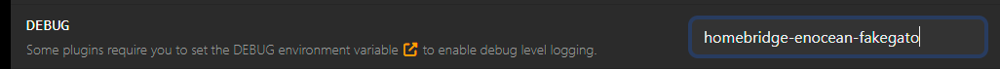

# Homebridge EnOcean Platform

Integrate EnOcean® devices into Homebridge.

## Supported EEPs

The plugin assigns accessories depending on the EEP. This can be overwritten in the config. Might be useful for contacts.

EEP | Accessory | EEP types
-|-|-
A5-02 | Temperature Sensors |  01 to 1B and 20 and 30
A5-04 | Temperature Sensors |  01 and 02
A5-08 | Motion Sensors |  01, 02 and 03
A5-10 | Leak Sensor | 0B - Temperature Sensor and Single Input Contact
A5-14 | Contact Sensor | 09 - Window/Door-Sensor with States Open/Closed/Tilt, Supply voltage monitor
A5-30 | Contact Sensor | Digital Input
A5-38-08 | Outlet | Central Command, Gateway type 08 is supported
A5-3F-7F Eltako | Window Covering | 7F Eltako specific
D1-Eltako | none | Used for auto teach-in with Eltako devices
D2-05.ts | Window Covering | 00 (not fully tested)
F6 | Switches | Programmable switch

Some accessories support multiple services. History service is provided by the fakegato module.

Accessory | Services and Characteristics (main service first)
-|-
Contact Sensor | ContactSensor, Battery, History
Leak Sensor | LeakSensor, TemperatureSensor, Battery, History
Motion Sensor | MotionSensor, Battery, LightSensor, History
Outlet | Outlet
ProgrammableSwitch | StatelessProgrammableSwitch
Temperature Sensor | TemperatureSensor, HumiditySensor, Battery, History
Window Covering | WindowCovering

## Platform configuration

Property | Description
-|-
name | Platform Name (`EnOcean`)
comDevice | Path to the EnOcean gateway device. E.g. `/dev/ttyUSB0`. USB300 type EnOcean gateway transceiver. Consider using `/dev/serial/by-id/<device>` on Raspian.
isAutoCreateEnabled | If enabled, the plugin will react on Eltako teach-in request messages (MSC type) and create and bind some devices automatically (default not enabled).
isLearnSwitchEnabled | Learn Switch. If enabled, the plugin will create a switch accessory (EnOcean Learn) to switch learn/teach-in mode on and off.
isHistoryServiceEnabled | Enable History Service for Eve App. If enabled, the plugin support the fakegato-history service to support history graphs in the Eve app.

If you see 'access denied' in the logs, for the gateway device, you might need to add the `homebridge` user to the plugdev group (`adduser homebridge plugdev` and `reboot` on Raspbian).

## EnOceanDevice configuration

Property | Description
-|-
eep | The EnOcean Equipment Profile (EEP) to be used for this device.
id | The EnOcean device ID. An eight digit hex number separated by a colon ':'. E.g. `1A:2B:3C:4D`. This number identifies the device uniquely within EnOcean scope.
name | The name of the device. This will be the initial name when the device appears in Homebridge.
manufacturer | The name of the manufacturer of this device. Some manufacturers (like Eltako) support special features.
model | The name of the model.
time | Window Covering: the travel time of the blinds in seconds (default 30 s). Contact Sensor: the time the contact is open before the status tampered is active. No effect on other accessories.
accessoryKind | Allows to override the created accessory. By default (auto) it is  determined by the EEP.
localSenderIndex | The offset to the transceiver Base ID to get the local ID. This is usually automatically assigned but can be overwritten here if necessary. See also [Local Sender IDs](#local-sender-ids).

## Teach-in

In order to teach-in (learn) new devices a *Learn Switch* accessory is provided.

1. It enables the plug-in to print all received messages to the logs (snoop).
2. It enables the plug-in to deal with teach-in messages. They are written to the logs.
3. It enabled transmission of teach-in messages when a manually configured accessory is activated (i.e. a switch is switched on/off).

The following approach is suggested (in that order) to bind new devices:

1. Auto create. Works with Eltako Tip-Funk devices.
2. Fully automatic teach-in.
3. Semi automatic teach-in
4. Manual configuration.

### Auto create

Some devices send an indication of their EEP and manufacturer if they are placed into teach-in mode. If possible they are automatically created and added to the configuration (Works with Eltako Tipp-Funk®). Auto create is enabled in the plugin by default.

### Fully Automatic teach-in

Works similar to auto create but requires the a. m. *Learn Switch* accessory set to on first. Then set the device teach/learn mode (works with NodON Roller Shutter actors, D2-05-00 profile and other devices which are capable of sending a teach-in message).

### Semi automatic teach-in

This method involves partially automating the teach-in process. First, activate the *EnOcean Learn* accessory. Then, manually trigger the teach-in mode on the device. The plugin will log the received messages, which can be used to configure the device in Homebridge.

### Manual teach-in

Manual teach-in involves configuring the device manually in the Homebridge configuration file. Ensure you have the correct EnOcean ID and EEP for the device. After configuration, restart Homebridge and verify the device functionality.

## Teach-in examples

### Devices with a teach button (unidirectional sensors)

1. Activate the *EnOcean Learn* accessory.
2. Command the device to transmit a learning message.

### Switches

Configure them manually. Turn on the *EnOcean Learn* accessory to capture the EnOcean ID from the logs.

They come with 2 rocker switches for the supported types 0x01 and 0x02. The four buttons will end up as four stateless programmable switches. The single, double and long press events are supported (not sure whether the double press makes sense though, it also delays the single press detection).

### Outlet actors F6-02-xx/A5-38-08

Some of them support auto create when they are set to learn mode.

#### Eltako FSSA-230V

1. Configuring the FSSA in Homebridge

    1. To figure out the EnOcean ID turn on the confirmation telegrams at the FSSA and activate the *EnOcean Learn* accessory. Monitor the Homebridge log while switching the FSSA using the right button, note the EnOcean ID.

    2. Manually create a device in the Homebridge configuration using the EnOcean ID and EEP `A5-38-08` or `F6-02-01`. Reboot Homebridge. The FSSA should now appear as accessory in Homebridge.

2. Teach-in Homebridge to the FSSA

    1. Set the FSSA to learn mode (left button 1 s, right button 2 times)
    2. Activate the *EnOcean Learn* accessory.
    3. Click the FSSA accessory in Homebridge. This will send a teach-in message to the FSSA.
    4. Turn off the *EnOcean Learn* accessory.
    5. Verify switching the FSSA from Homebridge.
    6. Verify confirmation telegrams are working by switching the FSSA using the right button.

Note: No advantage using the A5 EEP as it does not automatically enable acknowledge telegrams from the socket. They need to be enabled manually.

#### Eltako FSLA-230V

The Eltako FSLA-230V does not have any buttons but supports auto create. Set it to lean mode and it should be automatically detected. Acknowledge telegrams from the FSLA will be enabled.

## Technical details

### Local Sender IDs

As part of the concept of EnOcean the transceivers emulating different sender by using local sender IDs.

This plugin does not use the IDs directly but maintains offsets to the base ID of the transceiver. They are assigned automatically during teach-in and accessory creation. This local sender index is stored with the accessory (context) data in Homebridge. It can also be coerced by configuration (`localSenderIndex`).

### fakegato

*fakegato* debug level logging is off by default (it just doesn't get the log instance forwarded, so you won't see more severe messages as well). To enable it mention `homebridge-enocean-fakegato` in the DEBUG environment variable.

Example: 

See *Homebridge > Settings > Startup & Environment > DEBUG*.

The history is stored in files in the Homebridge persistence folder (`/var/lib/homebridge/persist` on Raspian). Filenames consist of the platform name and the EnOcean ID like `EnOceanPlatform.EnOID_11-22-33-44.history.json`.

## Acknowledgements

Thanks to [Henning Kerstan](https://github.com/henningkerstan) for the [enocean-core](https://github.com/henningkerstan/enocean-core) repo. That saved me to delve into the details of the EnOcean protocol, but also was a great resource for learning. The repository is licensed under the MIT License.

Also thanks to [simont77](https://github.com/simont77) for the [fakegato-history](https://github.com/simont77/fakegato-history) repo, which made it pretty easy to get the fancy history graphs in the Eve app. The repository is licensed under the MIT License.

And special thanks to the maintainer of the FHEM/[10_EnOcean](https://github.com/fhem/fhem-mirror/blob/master/fhem/FHEM/10_EnOcean.pm) Perl module for this comprehensive information source. The repository is licensed under the GPL-3.0 License.

---
